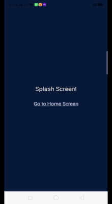

# react-native-nested-navigators

An example to illustrate how you can nest different navigators in React Native. 

Navigators             |  Visual Effects
:-------------------------:|:-------------------------:
<b>* @react-navigation/bottom-tabs</b><br/><b>* @react-navigation/drawer</b><br/><b>* @react-navigation/stack</b><br/><b>* @react-navigation/native</b> | 


## Folder Structure  

The main source files are located in the `views` folder. All the navigation routes are defined in `Root.js`

```
--App.js
--Views
----Root.js
----SplashScreen.js
----TabScreen1.js
----TabScreen2.js
----TabScreen3.js
----TabScreen4.js
----ContactScreen.js
```
## More Info

In this example, the bottom-tab screens are nested inside drawer-navigator. You can nest them in reverse order as well. The first screen is the splash screen & clicking on the home-page link would navigate to the drawer screen. The `initialRouteName` in the drawer-navigator is set to the screen component of the bottom-tabs navigator.

```
function MyDrawer({ navigation }) {
  return (
    <Drawer.Navigator initialRouteName="Home" drawerContent={props => <DrawerSidebarScreen {...props} />}>
      <Drawer.Screen name="Home" component={HomeTabs} />
      <Drawer.Screen name="Contact Us" component={ContactScreen} />
    </Drawer.Navigator>
  );
}

function HomeTabs({ navigation }) {
  return (
    <Tab.Navigator
      tabBarOptions={{
        activeTintColor: 'blue',
        inactiveTintColor: 'gray',
        title: 'Hello',
        style:{height:40, paddingBottom: 10}
      }}
    >
      <Tab.Screen name="Tab-1" component={TabScreen1} />
      <Tab.Screen name="Tab-2" component={TabScreen2} />
      <Tab.Screen name="Tab-3" component={TabScreen3} />
      <Tab.Screen name="Tab-4" component={TabScreen4} />
    </Tab.Navigator>
  );
}
```

## Author

Saurabh Kataria | https://mvpbuddy.io

[React-Native Apps](https://www.mvpbuddy.io)
Checkout our fully loaded app templates, built in <b>React Native</b>. These templates can help you build your mobile apps faster & help <b>save ~100 hours of dev. time</b>. Cheers!

## License
[MIT](./LICENSE)